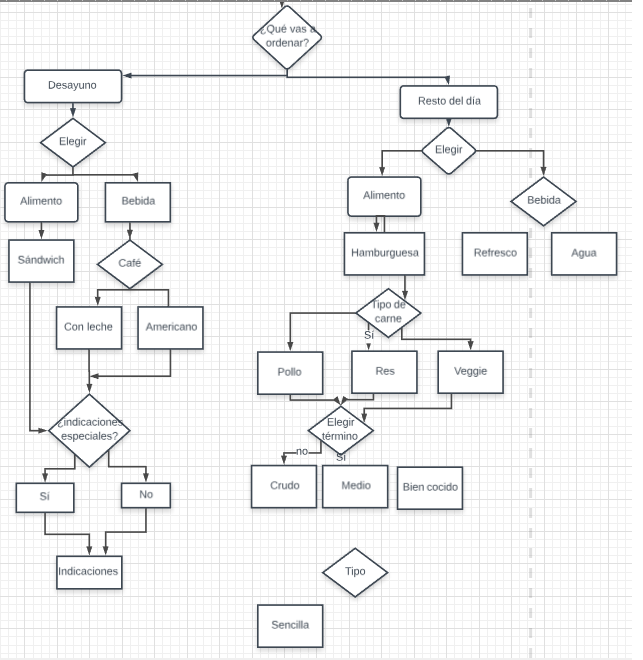
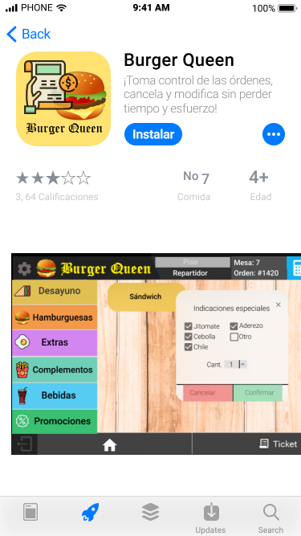
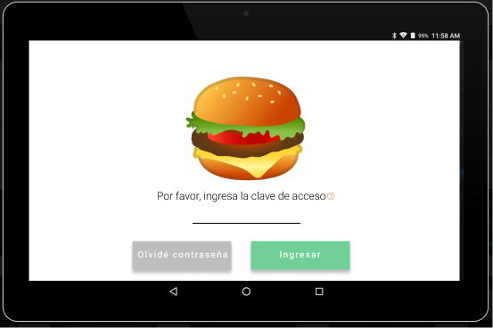
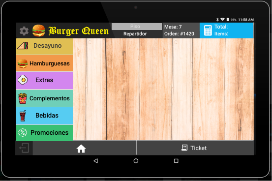
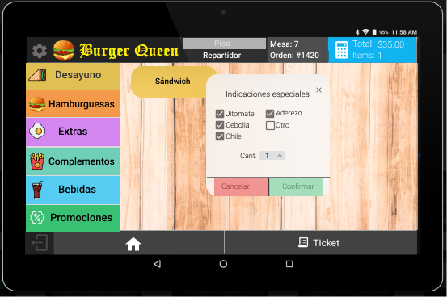
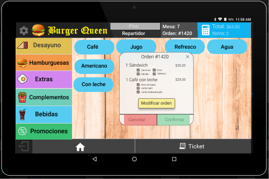
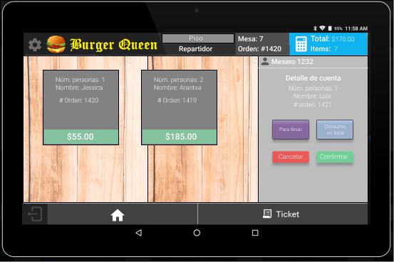
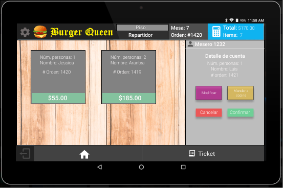
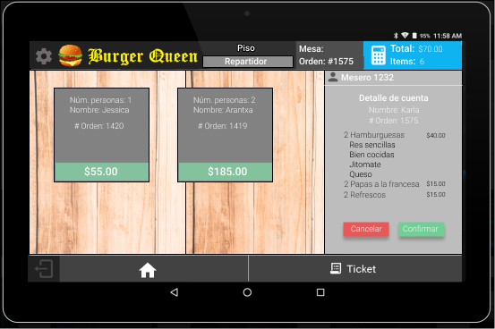

# BurgerQueen

Objetivo: crear el prototipo de una web app para uso dentro de Burger Queen, un restaurante de comida rápida que cuenta con dos opciones de menú: desayuno y comida. 

La propuesta del prototipo considera información para el cajero/mesero, donde existe la opción de elegir comer en el establecimiento, para llevar o para atender directamente a los repartidores de Uber Eats, Rappi, Postmates y otras cadenas de entrega a domicilio con el fin de pedir la orden de manera más rápida y eficiente.

### Contexto

Los preparadores de comida rápida son trabajadores que se encargan de múltiples actividades para poder cumplir con eficiencia sus labores, las cuales comienzan con la adquisición de los alimentos que posteriormente transforman en venta de comidas rápidas. Para su preparación cortan, pelan, lavan y organizan todos los ingredientes, ya sea de forma anticipada o en el lugar donde tienen su establecimiento; también se encargan del cobro del importe de las ventas.

Las condiciones laborales, así como la falta de tiempo, hacen que la comida rápida o fast food sea elegida por muchas personas para comer a bajo costo. En cuanto a las personas que trabajan en dichos establecimientos, los perfiles se enfocan en buscar personas con 17 años, con secundaria terminada, sin experiencia, "con actitud" y disponibilidad de tiempo.

De acuerdo a datos del INEGI, "al tercer trimestre de 2017 la cifra de ocupados como preparadores de comida rápida es casi de 1.6 millones en el país. La edad promedio de estos ocupados es de 41.9 años; 57% son mujeres y 43% hombres". Los trabajos en cadenas de comida rápida se caracterizan por su rotación de personal constante (de tres a seis meses), salario bajo, poca o nula capacitación, estrés por la carga de trabajo, ambiente laboral poco agradable.

En tema de empleabilidad en México, para las personas con alguna limitación física, encontrar empleo representa un reto mayor: sin importar si cuentan con la preparación adecuada, muchas empresas tienene el prejuicio de que no habrá un buen desempeño. La inclusión a personas con discapacidad se caracteria porque sólo el 39.1% de las personas con discapacidad tienen empleo y ganan 33.5% menos que el resto.

Del total de la población de 15 años o más con discapacidad, 32% no percibe ingresos. Y de lo que sí obtienen paga, las principales fuentes de ingreso son un trabajo (40.2%); programas sociales de gobierno (39%); por jubilación o pensión (21.6%) y por ayuda de familiares o conocidos (12.9%), de acuerdo con la Encuesta Nacional de la Dinámica Demográfica (2014).

Con base en lo anterior, la propuesta de la web app está diseñada para que cadenas de comida rápida como Burger Queen empleen a cajeros/meseros tanto del perfil habitual (personas con estudios truncos, estudiantes, etc.) y a personas discapacitadas.

### Propuesta

A partir de una investigación en campo y de un benchmark, se llegó a los siguientes hallazgos sobre el sistema que usan para tomar la orden del cliente:

 * Es difícil de entender.
 * No permite modificar la orden. 
 * Cuando se cancela una orden, el proceso es largo y casi siempre el cliente termina enojado, a veces se traba el sistema.
 * No siempre hay un orden: botones de color o categorías sin usar códigos confusos.
 * Para cancelar una orden hay que recurrir al gerente.

En consecuencia, la web app de Burger Queen busca distribuir el menú utilizando botones grandes y con colores específicos. Asimismo, se busca mantener informado al cajero/mesero del número de productos y el total a pagar en todo momento.

### Proceso de investigación y entrevista

Fotos de la entrevista a una ex-trabajadora en Dominos Pizza: 

Research acerca del funcionamiento de cómo pedir/pagar en los establecimientos de comida rápida:

Diagrama de flujo para pedir en Burger Queen:

Diagrama de flujo de orden:

##Prototipo de alta fidelidad (User Testing)
Imágenes editadas en Figma para crear la navegación en Marvel:

Pantalla de descarga de la web app.

Pantalla de inicio.

Menú con botones grandes, con íconos y colores.

Ejemplo de ordenar desayuno.

Ejemplo de orden de desayuno.

Ejemplo de orden de hamburguesas

Ejemplo de la información de orden.

Ejemplo de la información de orden, mostrando la opción de enviar a cocina.

)

Ejemplo de la información de orden por parte de un repartidor.

Link al prototipo de Marvel: https://marvelapp.com/3gj04ac/screen/55758116 

